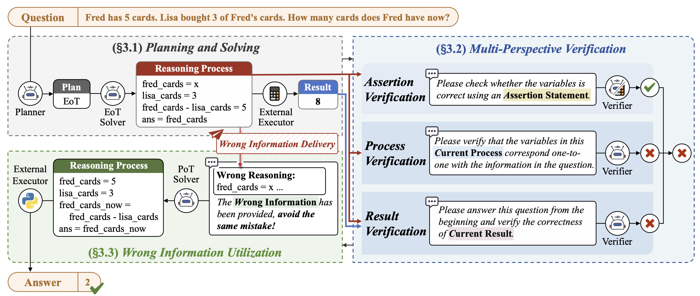
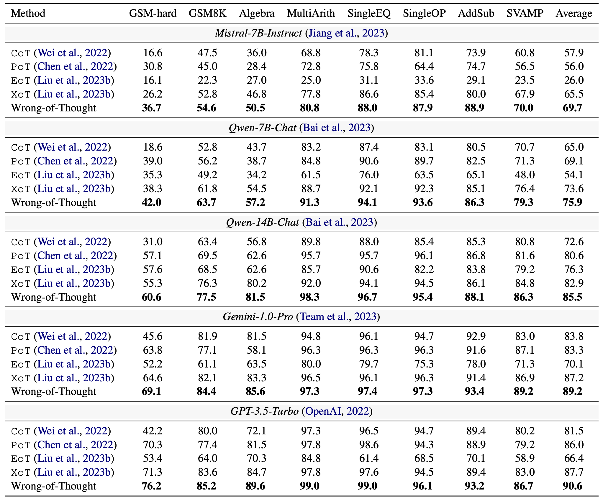

# Wrong-of-Thought: An Integrated Reasoning Framework with Multi-Perspective Verification and Wrong Information (WoT)


<div>


</div>

\
📷 This is the code repository for the paper: Wrong-of-Thought: An Integrated Reasoning Framework with Multi-Perspective Verification and Wrong Information. **EMNLP 2024 Findings**.

<div>

</div>

The overall workflow of WoT, which consist of Planning and Solving, **Multi-Perspective Verification**, and **Wrong Information Utilization**.

## Preparation steps: environment installation
(1) Environment installation command:
```python
pip install -r requirements.txt
```
---
(2) Please fill in the API information in the file: `src/brain.py`.
```python
openai.api_base = ""
KEY_GROUP = {'a': [""]}
```


## 💻 Stage 1: Perform WoT Reasoning.
(1) Please fill in the name of the dataset to be reasoned and the name of the model to be used in the file: `scripts/run_reasoning.sh`.

```python
DATASET='dataset_name'
MODEL='model_name'
```

where  [dataset_name] in ['gsm', 'gsmhard', 'algebra', 'addsub', 'singleop', 'singleeq', 'multiarith', 'svamp'].

---

(2) Run the following code to start using the WoT framework for reasoning.

```python
bash src/run_reasoning.sh
```

## 💻 Stage 2: Verification of WoT reasoning results.
(1) Please fill in the name of the dataset to be validated in the file: `scripts/eval.sh`.

```python
DATASET='dataset_name'
```

---

(2) Run the following code to obtain the result of WoT reasoning.

```python
bash src/eval.sh
```


## 💯 Model Performance
<div>

</div>


## 💬 Contact

Please create Github issues here or email [Yongheng Zhang](mailto:zyhbrz@gmail.com) or [Qiguang Chen](mailto:charleschen2333@gmail.com) or [Libo Qin](mailto:lbqin@csu.edu.cn) if you have any questions or suggestions.

